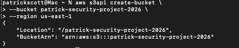
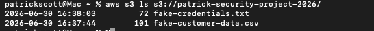
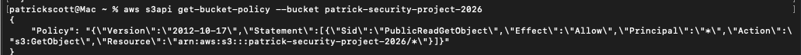
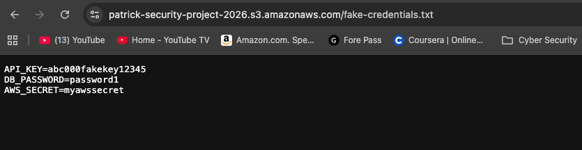
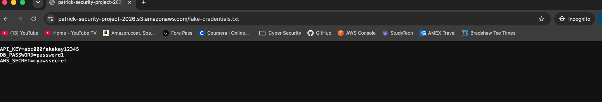
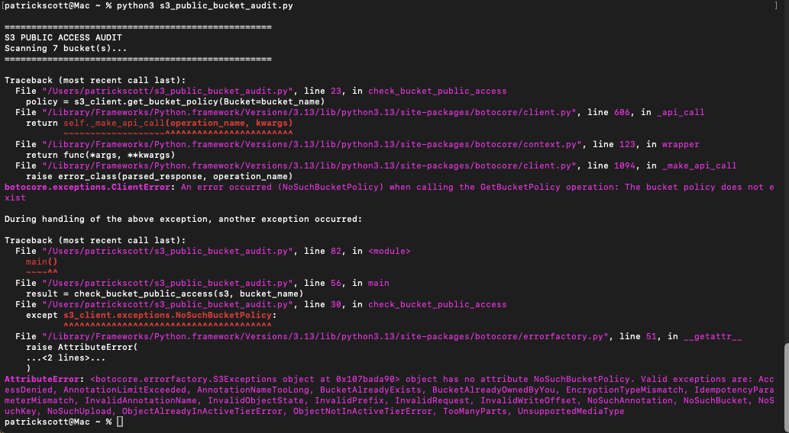
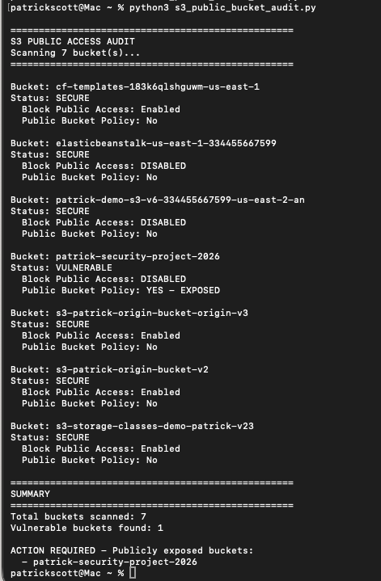
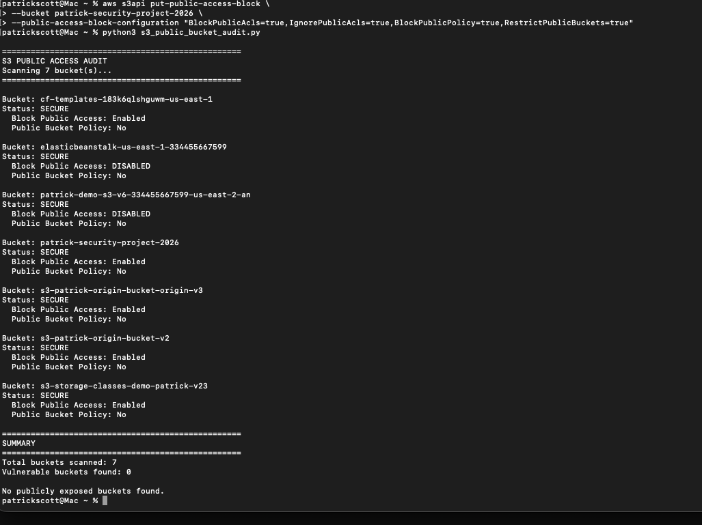
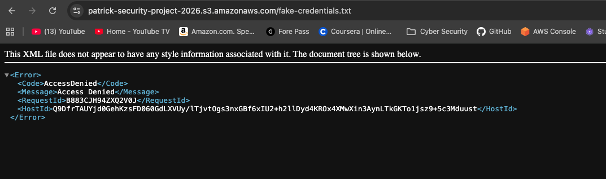
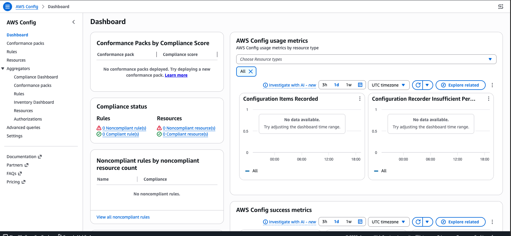

# S3 Misconfiguration Detection & Remediation

A cloud security project demonstrating how to identify, exploit, remediate, and prevent a common AWS S3 misconfiguration that exposes sensitive data to the public internet.

---

## Project Overview

Publicly exposed S3 buckets are one of the most common and costly cloud security misconfigurations. This project simulates that scenario end-to-end — from creating the vulnerability, to detecting it with a custom Python script, to remediating it and implementing a preventative control using AWS Config.

---

## Skills Demonstrated

- AWS S3 bucket policy configuration and access control
- IAM permissions and AWS CLI usage
- Python scripting with boto3 (AWS SDK)
- Misconfiguration detection through automated auditing
- Incident remediation (Block Public Access, bucket policy removal)
- Preventative controls using AWS Config managed rules
- Security documentation and evidence collection

---

## Tools & Technologies

- AWS S3
- AWS Config
- AWS CLI
- Python 3 / boto3
- botocore

---

## Architecture

```
┌─────────────────────────────────────────────────────┐
│                   AWS Account                        │
│                                                      │
│  ┌─────────────────┐      ┌──────────────────────┐  │
│  │   S3 Bucket     │      │     AWS Config       │  │
│  │                 │      │                      │  │
│  │ - customer data │◄─────│  s3-bucket-public-   │  │
│  │ - credentials   │      │  read-prohibited     │  │
│  │                 │      │  (Detective mode)    │  │
│  └─────────────────┘      └──────────────────────┘  │
│           ▲                                          │
│           │                                          │
│  ┌─────────────────┐                                 │
│  │  boto3 Audit    │                                 │
│  │  Script         │                                 │
│  │  (Python)       │                                 │
│  └─────────────────┘                                 │
└─────────────────────────────────────────────────────┘
```

---

## Project Stages

### Stage 1 — Create the Vulnerable Environment

Created an S3 bucket (`patrick-security-project-2026`) and uploaded two simulated sensitive files:
- `fake-customer-data.csv` — simulated PII (names, emails, SSNs)
- `fake-credentials.txt` — simulated API keys and passwords

The bucket was then deliberately misconfigured by:
1. Disabling Block Public Access at the bucket level
2. Applying a bucket policy with `"Principal": "*"` — granting read access to anyone on the internet

```json
{
  "Version": "2012-10-17",
  "Statement": [
    {
      "Sid": "PublicReadGetObject",
      "Effect": "Allow",
      "Principal": "*",
      "Action": "s3:GetObject",
      "Resource": "arn:aws:s3:::patrick-security-project-2026/*"
    }
  ]
}
```


> **Note:** AWS now blocks public access by default. Making a bucket public requires actively overriding multiple protections — which is why misconfigurations like this are typically the result of deliberate but poorly considered decisions, not accidents.

---

### Stage 2 — Demonstrate the Impact

With the bucket misconfigured, sensitive files were accessible to any unauthenticated user via a direct URL — no credentials required:

```
https://patrick-security-project-2026.s3.amazonaws.com/fake-credentials.txt
```

Accessing this URL in an incognito browser window returned the full file contents, simulating what an attacker or unauthorized user would see. This mirrors real-world S3 exposure incidents where sensitive data is discovered by scanning for publicly accessible buckets.


---

### Stage 3 — Detection (Automated Python Audit Script)

Wrote a boto3 Python script that scans all S3 buckets in an AWS account and flags any with public access enabled. The script checks two conditions:

1. Whether Block Public Access is disabled
2. Whether a public bucket policy exists with `Principal: *`

A bucket is only flagged as vulnerable when **both** conditions are true — this distinction matters because disabled Block Public Access alone does not expose a bucket.

**Script output against the vulnerable environment:**

```
==================================================
S3 PUBLIC ACCESS AUDIT
Scanning 7 bucket(s)...
==================================================

Bucket: patrick-security-project-2026
Status: VULNERABLE
  Block Public Access: DISABLED
  Public Bucket Policy: YES - EXPOSED

...

==================================================
SUMMARY
==================================================
Total buckets scanned: 7
Vulnerable buckets found: 1

ACTION REQUIRED - Publicly exposed buckets:
  - patrick-security-project-2026
```

The script correctly identified the one misconfigured bucket out of seven while marking the others as secure. See `s3_public_bucket_audit.py` for the full script.

---

### Stage 4 — Remediation

Remediated the misconfigured bucket using two AWS CLI commands:

**Step 1 — Remove the public bucket policy:**
```bash
aws s3api delete-bucket-policy \
  --bucket patrick-security-project-2026
```

**Step 2 — Re-enable Block Public Access:**
```bash
aws s3api put-public-access-block \
  --bucket patrick-security-project-2026 \
  --public-access-block-configuration \
  "BlockPublicAcls=true,IgnorePublicAcls=true,BlockPublicPolicy=true,RestrictPublicBuckets=true"
```

After remediation, attempting to access the bucket URL returned an **Access Denied** error, and re-running the audit script confirmed the bucket now shows as **SECURE**.


---

### Stage 5 — Preventative Control (AWS Config)

Configured AWS Config with the `s3-bucket-public-read-prohibited` managed rule to continuously monitor all S3 buckets for public access. This provides an ongoing detection layer beyond the point-in-time audit script.

**Configuration:**
- Recording strategy: Specific resource types (S3 only)
- Evaluation frequency: Daily
- Rule: `s3-bucket-public-read-prohibited`
- Evaluation mode: Detective

> **Detective vs. Proactive:** Detective mode flags violations after they occur. In a production environment this could be extended with a Lambda-backed auto-remediation action that automatically re-enables Block Public Access when a violation is detected — removing the need for manual intervention.



---

## Key Takeaways

- A single `"Principal": "*"` in a bucket policy can expose an entire bucket to the public internet
- AWS has multiple layers of public access protection — Block Public Access settings AND bucket policies both need to be evaluated
- Automated auditing at scale is essential — manually checking bucket policies across hundreds of buckets is not realistic
- Detection controls (audit scripts, AWS Config) and preventative controls (Block Public Access at the account level) should be used together
- The same boto3 script could be extended to run across multiple AWS accounts using assumed roles in an AWS Organization

---

## How to Run the Audit Script

**Prerequisites:**
- Python 3
- boto3 (`pip3 install boto3`)
- AWS CLI configured with appropriate credentials (`aws configure`)

**Run:**
```bash
python3 s3_public_bucket_audit.py
```

The script will scan all S3 buckets in the configured AWS account and print a report of any publicly exposed buckets.

---

## Cleanup

To avoid ongoing AWS Config charges after completing this project:

1. Delete the AWS Config recorder in the Config console under Settings
2. Delete the `config-logs-patrick-2026` S3 bucket
3. Delete the `patrick-security-project-2026` S3 bucket

